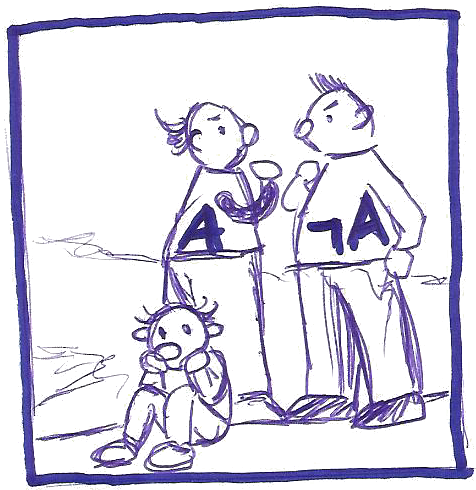

# The double-negation translation and the CPS transformation

Check out the [slides](negneg-translation.pdf) or their [annotated
version](negneg-translation-notes.pdf).

**Abstract.** Constructive mathematicians don't use the law of excluded middle, which
approximately says that for any proposition P, either P is true or not-P
is true. Several advantages emerge from this rejection, for instance one
can mechanically extract algorithms from constructive proofs of existence
statements and rigorously work with non-standard *dream axioms* which are
plainly false in classical mathematics, such as *any function is
smooth*.

For communicating with classicial mathematicians, constructive
mathematicians can employ the *double-negation translation*. This
device associates to any formula a translated formula in such a way that
a given formula holds classically if and only if its translation holds
constructively.

The talk will give an introduction to these topics and discuss the
intriguing relationship of the double-negation translation with the
well-known continuation style transformation: In some sense, they are
the same. This is a beautiful facet of *computational trinitarianism*.

For the first part of the talk, no background in formal logic or
constructive mathematics is required. For the second part of the talk,
one should be vaguely familiar with the continuation-passing style
transformation.

